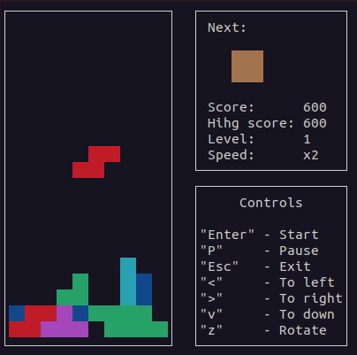
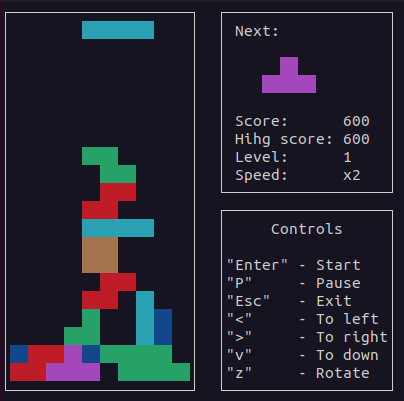

# BrickGame v1.0 (Tetris)

This repository contains **BrickGame v1.0**, a Tetris implementation developed in C using the C11 standard. The game features a modular architecture, separating the core game logic into a library and the user interface into a terminal-based GUI built with `ncurses`.


## Table of Contents
- [Features](#features)
- [Installation](#installation)
- [Usage](#usage)
- [Game Mechanics](#game-mechanics)
- [Score and Records](#score-and-records)
- [Levels](#levels)
- [Development Details](#development-details)

---

## Features
- Developed in **C** (C11 standard) using **GCC**.
- Modular design:
  - **Core Library**: Implements Tetris game logic.
  - **GUI**: Terminal interface built with `ncurses`.
- Implements a **finite state machine (FSM)** for game logic.
- Designed with **structured programming principles**.
- Follows **Google Style** for code.
- Built using **Makefile** with standard GNU targets: `all`, `install`, `uninstall`, `clean`, `dvi`, `dist`, `test`, `gcov_report`.
- Cross-platform testing on **Darwin/Ubuntu**.

---

## Installation

### Clone the Repository
```bash  
git clone git@github.com:le0ruslan/brickgame-tetris.git
cd brickgame-teris/src
```

### Install the Game
```bash  
make install
```

---
## Usage
* Controls:
  - **"Enter":** Start game.
  - **"P":** Pauses the current game.
  - **"Esc":** Exits the game.
  - **"<":** Moves the piece left.
  - **">":** Moves the piece right.
  - **"v":** Drops the piece one step.
  - **"z":** Rotates the piece.



---
## Game Mechanics
### Core Features

- **Game Field Dimensions:** 10 pixels wide and 20 pixels tall.
- **Piece Movement:** Rotate, move horizontally, and accelerate to the bottom.
- **Preview:** Displays the next piece.
- **Line Clear:** Removes filled rows and awards points.
- **Game Over:** Ends the game when pieces reach the top.


### Library Functions
* Processes user input.
* Outputs the updated game state matrix.

---

## Score and Records
### Scoring System

* 1 Line: **100 points**
* 2 Lines: **300 points**
* 3 Lines: **700 points**
* 4 Lines: **1500 points**


### Record System
* Saves the highest score between sessions.
* Displays the current and highest scores on the side panel.
* Records are stored in a file or embedded database.
---

## Levels

* Level increases every **600 points.**
* Each level increases the speed of falling pieces.
* Maximum level: **10.**
---

## Development Details

### Folder Structure

* **Game Logic:** src/brick_game/tetris
* **GUI Code:** src/gui/cli


### Testing
* Unit Testing:
    - Implemented using the check library.
    - Covers at least 80% of the core library with tests.
* Code Coverage:
    - Generate reports with make gcov_report.

### FSM Diagram
- A finite state machine diagram is provided to explain the states and transitions used in the game logic.
---